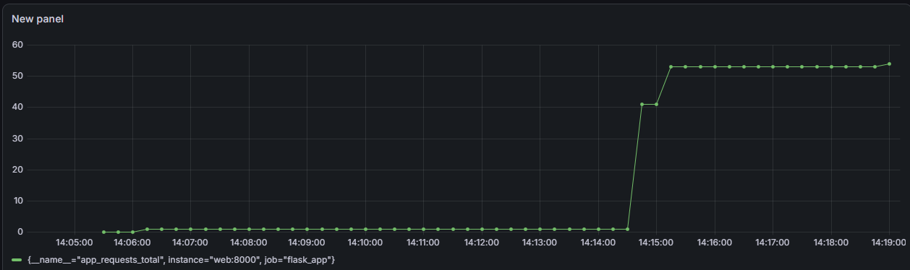

# Microservice Observability Prototype

A lightweight, containerized observability pipeline designed to monitor a Python web application using industry-standard DevOps and DataOps tools.

##  Tech Stack
- **Backend:** Python (Flask), Prometheus Client
- **Metrics Collection:** Prometheus
- **Visualization & Dashboarding:** Grafana
- **Infrastructure:** Docker, Docker Compose

##  Architecture & Workflow
1. **Flask Application:** A simple backend service running on port `5000` that exposes application-specific metrics on port `8000`.
2. **Prometheus:** Scrapes time-series metrics from the Flask application every 5 seconds.
3. **Grafana:** Connects to Prometheus as a data source to visualize request counts and system health metrics in real time.

##  Dashboard Preview
Below is the live Grafana dashboard capturing real-time traffic and request count metrics (`app_requests_total`) from the Flask microservice:



##  How to Run
Ensure you have Docker and Docker Compose installed. Then, execute:

```bash
docker-compose up --build

Access the services via:

Flask App: http://localhost:5000

Prometheus: http://localhost:9090

Grafana: http://localhost:3000